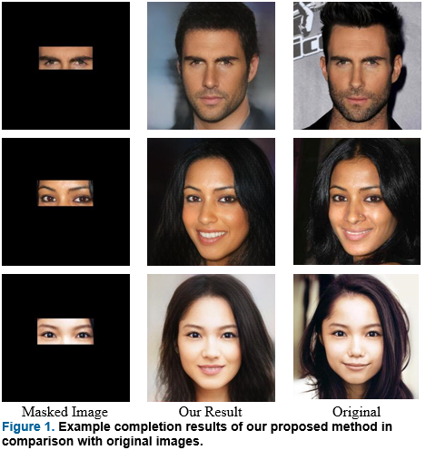

**E2F-GAN: Eyes-to-Face Inpainting via Edge-Aware Coarse-to-Fine GANs**
=======================================================================
This is the Tensorflow 2.0 implementation of paper 'E2F-GAN: Eyes-to-Face Inpainting via Edge-Aware Coarse-to-Fine GANs' which is accepted by IEEE Access journal.

**Introduction**
------------------------------------------------------------------------------------------------
This paper proposed a novel GAN-based deep learning model called Eyes-to-Face GAN (E2F-GAN) which includes two main modules: a coarse module and a refinement module. The coarse module along with an edge predictor module attempts to extract all required features from a periocular region and to generate a coarse output which will be refined by a refinement module. Additionally, a dataset of eyes-to-face synthesis has been generated based on the public face dataset called CelebA-HQ for training and testing. Thus, we perform both qualitative and quantitative evaluations on the generated dataset. Experimental results demonstrate that our method outperforms previous learning-based face inpainting methods and generates realistic and semantically plausible images. 



Prerequisites
---------------------------------
* Python 3.7
* Tensorflow 2.0
* NVIDIA GPU + CUDA cuDNN

Installation
---------------------------------
* Clone this repo:
```
git clone https://github.com/amiretefaghi/E2F-GAN
cd E2F-GAN-master
```
* Install Tensorflow
* Install Tensorflow-addons

Dataset
---------------------------------
We conduct all experiments on our generated dataset called E2Fdb extracted from the well-known [CelebA-HQ](https://github.com/tkarras/progressive_growing_of_gans) dataset. To extract the periocular region from each face image, the images are reshaped to size  256 ×256 and then by utilizing a landmark detector , eyes are detected. Doing this, M and I_m are produced for each image. Moreover, we removed misleading samples including those eyes covered by sunglasses or faces that have more than 45 degrees in one angle (roll, pitch, yaw) leading to hiding one of the eyes by using WHENet algorithms. Finally, the total number of 
samples is 24,554 among which 22,879 will be used for the training process and the rest, which is 1,685 images, for the test.

Getting Started
--------------------------
To use the pre-trained models, download them from the following links then copy them to corresponding checkpoints folder, like `./gan/`.

[CelebA-HQ](https://drive.google.com/drive/folders/1U22oNU8k1F_ORp76kVgkJARJYYfVpNB6?usp=sharing)

### 0.Quick Testing
To hold a quick-testing of our inpaint model, download our pre-trained models of CelebA-HQ and put them into `./example`, then run:
```
python3 test.py --model 3 --checkpoints ./example
```
and check the results in `./example/results`.

### 1.Training 
Before training process you should provide text files that contain direction of each picture of dataset.
The inpaint model is trained in two stages: 1) train the edge prediction model, 2) train the image inpaint model. To train the model, therefore same as [Edge-connect](https://github.com/knazeri/edge-connect), we should train edge prediction network and use its weights to execute another part of training. After training Edge prediction network run:

```
python train.py --batch_size 4 \
                --train_images_path './images_path_n.txt' \
                --train_masks_path './mask_images_path_n.txt' \
                --val_images_path './val_image_paths.txt' \
                --val_masks_path './val_mask_paths.txt' \
                --dual 2 \
                --pre_epoch 2 \
                --refinement True \
                --name 'gan' \
                --save_path './gan' \
``` 


